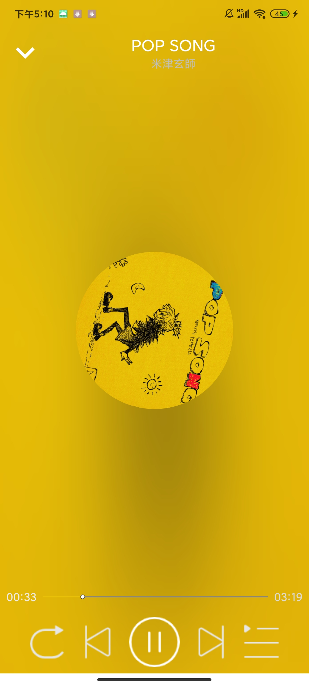

# PureJoy


PureJoy is a third-party open source Android client developed based on the relevant interface of NetEase CloudMusic.

The purpose of developing this application is to practice the knowledge we have learned and to translate the theory into practice.


## API

As for the API, we deployed an open source project called "NeteaseCloudMusicApi" on our own server to get network data for our application. We recommend that you deploy the "NeteaseCloudMusicApi" project on your own server to ensure the stable running of your application.

For details, see [Binaryify/NeteaseCloudMusicApi](https://github.com/Binaryify/NeteaseCloudMusicApi).

You can replace the server address in the ServiceCreator.kt file of the project：

```kotlin
private const val BASE_URL = "..."
```


## Screenshots
<table>
    <tr>
        <td></td>
        <td></td>
        <td></td>
    </tr>
</table>
<table>
    <tr>
        <td></td>
        <td></td>
        <td></td>
    </tr>
</table>


## Contributors

1. [usagisang](https://github.com/usagisang)

2. [lanlin-code](https://github.com/lanlin-code)

3. [giagor](https://github.com/giagor)


## License

```
MIT License

Copyright (c) 2021 TopView Android

Permission is hereby granted, free of charge, to any person obtaining a copy
of this software and associated documentation files (the "Software"), to deal
in the Software without restriction, including without limitation the rights
to use, copy, modify, merge, publish, distribute, sublicense, and/or sell
copies of the Software, and to permit persons to whom the Software is
furnished to do so, subject to the following conditions:

The above copyright notice and this permission notice shall be included in all
copies or substantial portions of the Software.

THE SOFTWARE IS PROVIDED "AS IS", WITHOUT WARRANTY OF ANY KIND, EXPRESS OR
IMPLIED, INCLUDING BUT NOT LIMITED TO THE WARRANTIES OF MERCHANTABILITY,
FITNESS FOR A PARTICULAR PURPOSE AND NONINFRINGEMENT. IN NO EVENT SHALL THE
AUTHORS OR COPYRIGHT HOLDERS BE LIABLE FOR ANY CLAIM, DAMAGES OR OTHER
LIABILITY, WHETHER IN AN ACTION OF CONTRACT, TORT OR OTHERWISE, ARISING FROM,
OUT OF OR IN CONNECTION WITH THE SOFTWARE OR THE USE OR OTHER DEALINGS IN THE
SOFTWARE.
```

